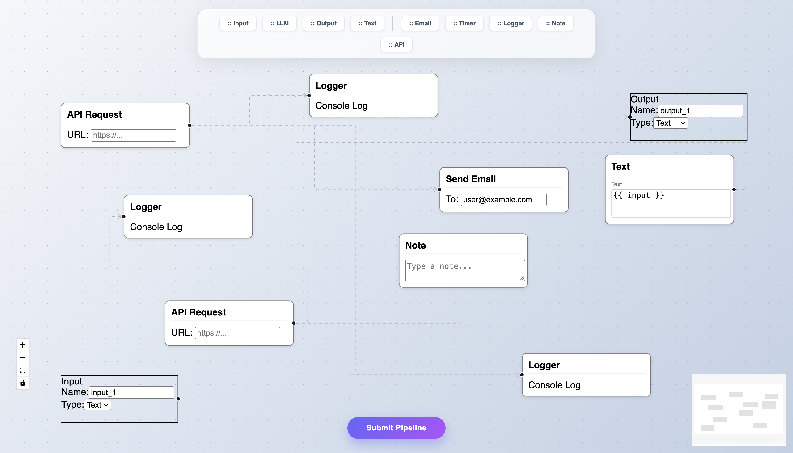

# FlowForge 🚀

**FlowForge** is a modern, modular, and infinite-canvas pipeline builder designed for the VectorShift Technical Assessment. It allows users to visually design Directed Acyclic Graphs (DAGs) with a sleek, floating UI and real-time backend validation.



## ✨ Key Features

### 🎨 Modular Design
- **BaseNode Abstraction**: Built a robust, reusable component architecture (`BaseNode.js`) that allows for rapid scaling of node types without code duplication.
- **Custom Nodes**: Includes 9+ node types (LLM, Input, Output, Text, Email, API, etc.) derived from a single abstraction.

### 🧠 Smart Text Logic
- **Variable Extraction**: Text nodes automatically parse inputs for `{{ variable }}` syntax using Regex.
- **Dynamic Handles**: Instantly generates reactive handles on the left side of the node when variables are detected.
- **Auto-Resizing**: Text areas dynamically adjust height based on content for a seamless UX.

### ⚡ Backend Integration
- **FastAPI Powered**: A lightweight Python backend handles graph processing.
- **DAG Validation**: Implements **Kahn’s Algorithm** (O(V+E)) to detect cycles and validate that the pipeline is a Directed Acyclic Graph.
- **Real-time Analytics**: Calculates node/edge counts and graph validity instantly.

### 💎 UI/UX
- **Glassmorphism**: A custom "Floating Dock" toolbar and notification system designed to maximize the canvas workspace.
- **Draggable Architecture**: Fully interactive drag-and-drop system using React Flow.

---

## 🛠️ Tech Stack

- **Frontend**: React.js, React Flow, Zustand (State Management)
- **Backend**: Python, FastAPI, Uvicorn, Pydantic
- **Styling**: Pure CSS3 (Gradients, Glassmorphism, Animations)

---

## 🚀 Getting Started

Follow these steps to run FlowForge locally.

### 1. Clone the Repository
```bash
git clone [https://github.com/Ayush1Deshmukh/FlowForge.git](https://github.com/Ayush1Deshmukh/FlowForge.git)
cd FlowForge
```
2. Backend Setup (Python)
Navigate to the backend folder and start the server.

```bash

cd backend
python3 -m venv venv           # Create virtual environment
source venv/bin/activate       # Activate env (Windows: venv\Scripts\activate)
pip install fastapi uvicorn pydantic python-multipart
uvicorn main:app --reload      # Server running at [http://127.0.0.1:8000](http://127.0.0.1:8000)
```
3. Frontend Setup (React)
Open a new terminal, navigate to the frontend, and start the app.

```bash
cd frontend
npm install
npm start                      # App running at http://localhost:3000
```
📂 Project Architecture
```bash

├── frontend/
│   ├── src/
│   │   ├── nodes/         # 🧠 BaseNode abstraction & individual node logic
│   │   ├── submit.js      # 🔌 API Integration & Floating Submit Button
│   │   ├── toolbar.js     # 🎨 Draggable Node Toolbar
│   │   ├── ui.js          # 🖼️ Main Canvas Wrapper
│   │   └── store.js       # 📦 Zustand State Store
│   └── ...
├── backend/
│   ├── main.py            # 🐍 FastAPI App & DAG Logic
│   └── ...
└── README.md
```
# 💡 How It Works
Drag & Drop: Select a node type from the floating toolbar and drag it onto the canvas.

Connect: Link nodes together to create a pipeline.

Variables: Type {{ input }} in a Text Node to create dynamic connection points.

Submit: Click the floating "Submit Pipeline" button.

Result: The backend analyzes the graph structure and returns a toast notification indicating if the pipeline is valid.
